# Cattle Feed ERP — Entity Relationship Diagram

```mermaid
erDiagram
    roles ||--o{ users : "has"
    users ||--o{ password_reset_tokens : "has"
    users ||--o{ activity_logs : "performs"
    users ||--o{ notifications : "receives"

    categories ||--o{ products : "contains"
    brands ||--o{ products : "manufactures"

    suppliers ||--o{ purchases : "supplies"
    purchases ||--|{ purchase_items : "contains"
    products ||--o{ purchase_items : "included_in"

    customers ||--o{ sales : "buys"
    customers ||--o{ payments : "pays"
    customers ||--o{ customer_ledger : "has"

    sales ||--|{ sale_items : "contains"
    products ||--o{ sale_items : "sold_as"
    sales ||--o{ sale_payments : "paid_via"
    sales ||--o{ payments : "partial_payment"

    products ||--o{ stock_movements : "tracked"

    users ||--o{ purchases : "creates"
    users ||--o{ sales : "creates"
    users ||--o{ payments : "records"
    users ||--o{ cash_book : "records"
    users ||--o{ expenses : "creates"

    roles {
        int id PK
        varchar name UK
        json permissions
        tinyint is_active
        datetime created_at
    }

    users {
        int id PK
        int role_id FK
        varchar username UK
        varchar email UK
        varchar password_hash
        varchar full_name
        varchar phone
        tinyint is_active
        datetime last_login_at
        datetime created_at
        datetime updated_at
    }

    customers {
        int id PK
        varchar name
        varchar phone UK
        varchar village
        text address
        decimal opening_balance
        enum opening_balance_type
        decimal credit_limit
        text notes
        tinyint is_active
        datetime created_at
        datetime updated_at
    }

    suppliers {
        int id PK
        varchar name
        varchar phone
        text address
        varchar gst_number
        decimal opening_balance
        text notes
        tinyint is_active
        datetime created_at
        datetime updated_at
    }

    products {
        int id PK
        int category_id FK
        int brand_id FK
        varchar name
        varchar sku UK
        varchar barcode UK
        decimal purchase_price
        decimal selling_price
        decimal gst_rate
        decimal current_stock
        decimal min_stock
        enum status
        datetime created_at
        datetime updated_at
    }

    purchases {
        int id PK
        int supplier_id FK
        varchar invoice_number
        date purchase_date
        decimal subtotal
        decimal tax_amount
        decimal discount_amount
        decimal total_amount
        decimal paid_amount
        enum payment_status
        text remarks
        int created_by FK
        datetime created_at
    }

    purchase_items {
        int id PK
        int purchase_id FK
        int product_id FK
        decimal quantity
        decimal purchase_price
        decimal selling_price
        decimal gst_rate
        decimal tax_amount
        decimal total_amount
    }

    sales {
        int id PK
        varchar invoice_number UK
        int customer_id FK
        datetime sale_date
        decimal subtotal
        decimal tax_amount
        decimal discount_amount
        decimal total_amount
        decimal paid_amount
        decimal pending_amount
        enum payment_status
        enum primary_payment_method
        text remarks
        int created_by FK
        datetime created_at
    }

    sale_items {
        int id PK
        int sale_id FK
        int product_id FK
        decimal quantity
        decimal purchase_price
        decimal selling_price
        decimal gst_rate
        decimal tax_amount
        decimal discount_amount
        decimal total_amount
        decimal profit_amount
    }

    sale_payments {
        int id PK
        int sale_id FK
        enum payment_method
        decimal amount
        varchar reference_number
        datetime created_at
    }

    payments {
        int id PK
        int customer_id FK
        int sale_id FK
        date payment_date
        decimal amount
        enum payment_method
        varchar reference_number
        text remarks
        int created_by FK
        datetime created_at
    }

    customer_ledger {
        int id PK
        int customer_id FK
        datetime transaction_date
        enum transaction_type
        varchar reference_type
        int reference_id
        decimal debit
        decimal credit
        decimal balance
        text remarks
        int created_by FK
        datetime created_at
    }

    cash_book {
        int id PK
        date transaction_date
        enum transaction_type
        varchar category
        decimal amount
        enum payment_method
        varchar reference_type
        int reference_id
        decimal balance_after
        text remarks
        int created_by FK
        datetime created_at
    }

    stock_movements {
        int id PK
        int product_id FK
        enum movement_type
        decimal quantity
        enum reference_type
        int reference_id
        decimal purchase_price
        decimal selling_price
        decimal balance_after
        text remarks
        int created_by FK
        datetime created_at
    }

    expenses {
        int id PK
        date expense_date
        varchar category
        decimal amount
        enum payment_method
        text description
        int created_by FK
        datetime created_at
    }

    settings {
        int id PK
        varchar setting_key UK
        text setting_value
        varchar description
        datetime updated_at
    }

    activity_logs {
        int id PK
        int user_id FK
        varchar action
        varchar entity_type
        int entity_id
        json details
        varchar ip_address
        datetime created_at
    }

    notifications {
        int id PK
        int user_id FK
        varchar title
        text message
        enum type
        tinyint is_read
        datetime created_at
    }
```

## Cardinality Notes

| Relationship | Cardinality | Description |
|-------------|-------------|-------------|
| Role → User | 1:N | Each user has exactly one role |
| Customer → Sale | 1:N | Customer can have many invoices; walk-in sales may have NULL customer |
| Sale → Sale Items | 1:N | Each invoice has one or more line items |
| Sale → Sale Payments | 1:N | Split payments supported |
| Product → Stock Movements | 1:N | Full audit trail of stock changes |
| Supplier → Purchase | 1:N | Multiple purchase entries per supplier |
